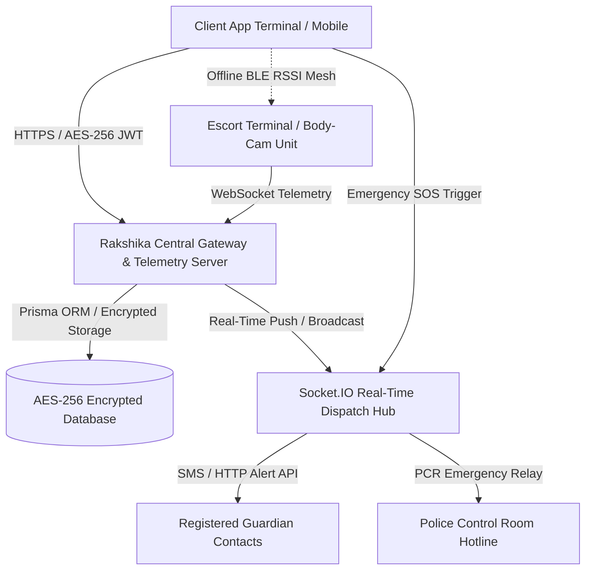

# SYSTEM AND METHOD FOR REAL-TIME SECURE PERSONAL SAFETY TELEMETRY, POLICE-VERIFIED ESCORT DISPATCH, AND MESH-BACKED EMERGENCY SOS BROADCAST WITH CRYPTOGRAPHIC HANDOFF

**Document Type:** Patent Application Specification  
**Invention Title:** SYSTEM AND METHOD FOR REAL-TIME SECURE PERSONAL SAFETY TELEMETRY, POLICE-VERIFIED ESCORT DISPATCH, AND MESH-BACKED EMERGENCY SOS BROADCAST WITH CRYPTOGRAPHIC HANDOFF  
**Field of Invention:** Mobile Security Networks, Real-Time Telemetry Tracking, Cryptographic Handoff Protocols, Emergency Dispatching, and Ad-Hoc Emergency Beaconing Systems.  
**Inventor Name:** [User / Patent Applicant Name]  
**Date of Filing:** August 8, 2026  

---

## 1. TECHNICAL FIELD OF THE INVENTION

The present invention relates generally to personal safety, emergency response networks, and secure transport dispatch systems. More specifically, the present invention relates to a system and computer-implemented method for:
1. Orchestrating on-demand dispatch of police-vetted and background-verified female security escorts ("lady guards/bouncers");
2. Establishing a cryptographic handoff lock between a protected user and a dispatched escort using field-encrypted identity metrics and secure PIN handshakes;
3. Maintaining a real-time WebSocket telemetry stream for anomaly detection, geofenced tracking, and automatic emergency SOS panic dispatching; and
4. Operating an ad-hoc offline Bluetooth Low Energy (BLE) mesh fallback mechanism for low-connectivity environments.

---

## 2. BACKGROUND AND PRIOR ART

### 2.1 Background
Personal safety during night-time transit, inter-city commute (e.g., examination travel, late-night flight/train arrivals), and crowded public events remains a critical global concern, particularly for women, students, and vulnerable individuals. While ride-hailing platforms offer basic GPS route tracking, they lack dedicated physical protection, verified personal escorts, and resilient emergency response protocols capable of operating when cellular signals fail.

### 2.2 Problems with Prior Art Systems
1. **Unverified & Generic Escorts:** Standard ride-share platforms pair riders with un-vetted drivers without specialized tactical training, body-camera surveillance, or government police background verification.
2. **Vulnerability to Identity Spoofing:** Traditional pick-up verification relies on simple text names, allowing unauthorized third parties to masquerade as assigned escorts.
3. **Single Point of Failure in Cellular Emergency SOS:** Conventional emergency applications rely exclusively on active HTTP/cellular data connections. In subterranean transit (e.g., underground metro lines, basements, remote transit hubs), cellular connections drop, disabling panic alerts.
4. **Lack of Automated Escrow & Financial Protection:** Prior systems require advance payments without cryptographic confirmation that physical handoff between guard and client actually took place, exposing clients to fraud or non-appearance.

---

## 3. SUMMARY OF THE INVENTION

The present invention, titled **RAKSHIKA**, addresses the technical drawbacks of prior systems by providing a unified, secure telemetry network and physical escort dispatch framework.

### 3.1 Key Objectives & Technical Innovations
1. **Encrypted Aadhaar & Government ID KYC Pipeline:** Implements AES-256-CBC field-level encryption for storing sensitive identification numbers (e.g., Aadhaar, Passport, Police Verification IDs). Sensitive data is decrypted strictly in ephemeral memory for authorization checks.
2. **Cryptographic Handoff Lock:** Generates an ephemeral cryptographic PIN/OTP code upon booking confirmation. Transit authorization and escrow release require a physical two-factor match between the client terminal and the escort terminal.
3. **Real-Time Telemetry & Anomaly Engine:** Utilizes full-duplex WebSocket connections for sub-second GPS coordinate streaming, path progress calculation, battery level reporting, and dynamic ETA tracking.
4. **Multi-Tier Emergency SOS Dispatch Pipeline:** Upon panic trigger (via physical UI swipe, rapid tap sequence, or anomaly detection), the system automatically:
   - Locks local state to SOS emergency mode;
   - Activates background audio recording/microphone stream;
   - Dispatches emergency SMS alerts to pre-registered guardian contacts;
   - Relays real-time telemetry coordinates to local Police Control Rooms (PCR); and
   - Alerts nearby body-camera-equipped escorts within a geofenced radius.
5. **Offline Bluetooth Mesh Fallback:** Incorporates a Received Signal Strength Indicator (RSSI) proximity sensing mechanism over BLE mesh when cellular connectivity drops below a defined threshold.

---

## 4. BRIEF DESCRIPTION OF THE DRAWINGS

- **Figure 1**: Architectural Block Diagram of the Rakshika System Components.
- **Figure 2**: Flowchart of the Cryptographic Escort Booking and Handoff Lock Protocol.
- **Figure 3**: State Transition Diagram of the Emergency SOS Beaconing Pipeline.



---

## 5. DETAILED DESCRIPTION OF PREFERRED EMBODIMENTS

### 5.1 System Architecture
The system comprises four primary interconnected modules:
1. **Client Application Terminal:** A mobile interface allowing users or guardians to select verified escorts, track transit in real time, and trigger panic beacons.
2. **Escort Terminal Interface:** A mobile application utilized by police-verified female escorts ("Lady Bouncers"), providing live navigation, body-camera telemetry, and handoff PIN validation.
3. **Telemetry & Central Server Engine:** An Express/Node.js backend utilizing WebSocket protocol (`Socket.IO`) and HTTP REST APIs for managing identity sessions, geofences, and booking lifecycles.
4. **Encrypted Data Store:** A database (e.g., SQLite/PostgreSQL managed via Prisma ORM) enforcing AES-256-CBC field encryption for all Aadhaar and national ID credentials.

### 5.2 Cryptographic Security & Identity Verification Protocol
Sensitive fields (such as `aadhaarNumber` or `policeId`) are processed according to the following mathematical specification:
\[
C = \text{IV} \parallel \text{AES-256-CBC}_{K}(P)
\]
Where:
- \( P \) is the plaintext identification string.
- \( K \) is a 32-byte secret encryption key derived from environment secrets.
- \( \text{IV} \) is a 16-byte cryptographically random Initialization Vector generated per record.
- \( C \) is the hex-encoded cipher text stored in the database.

Passwords are salted and hashed via bcrypt (\( \ge 10 \) rounds). Session authorization tokens employ JSON Web Tokens (JWT) signed with HMAC-SHA256, transmitted exclusively over secure HTTP cookies (`httpOnly`).

### 5.3 Booking Escrow State Machine and Handoff Lock
The lifecycle of an escort assignment adheres to a deterministic finite state machine:

```
[ PENDING ] ──> [ CONFIRMED ] ──(PIN Handoff)──> [ EN_ROUTE / ACTIVE ] ──> [ COMPLETED ]
                      │                                    │
                      └───> [ CANCELLED ]                  └──(Panic Trigger)──> [ SOS_ALERT ]
```

1. **State Initialization (`PENDING`):** User defines pickup/destination coordinates, select guard count, date, time slot, and transit type (e.g., Hourly Transit, Inter-city Exam Mode).
2. **Escrow Lock (`CONFIRMED`):** Financial funds equal to `hourlyRate * hours * guardCount` are locked in an escrow database state. An ephemeral 4-digit security PIN \( S \in \{1000 \dots 9999\} \) is generated and stored.
3. **Physical Handoff Match (`ACTIVE`):** Upon physical arrival, the client terminal displays PIN \( S \). The escort enters \( S \) into the escort terminal. Upon validation:
   - Journey state updates to `ACTIVE`;
   - Continuous telemetry monitoring commences;
   - Escrow unlock timer is initialized.
4. **Completion (`COMPLETED`):** Upon reaching destination coordinates within a geofenced radius \( R \le 50\text{m} \), the escrow is settled and funds are credited to the verified escort.

### 5.4 Multi-Tier Emergency SOS Pipeline
Upon detection of an SOS trigger (manual UI activation or anomaly condition such as prolonged off-route deviation):
1. **Audio Capture:** Client device silently initializes ambient audio recording simulation and relays audio packets to the server.
2. **Battery & Location Telemetry:** Device sends snapshot containing exact GPS latitude/longitude, altitude, battery percentage, and timestamp.
3. **Guardian Broadcast:** Server generates auto-SMS alerts to all registered emergency contacts with a direct live-tracking URL.
4. **PCR Relay:** System transmits an high-priority alert payload to the central emergency dispatch database table (`SOSAlert`), logging event timestamp and notifying nearest active security personnel.

---

## 6. PATENT CLAIMS (WHAT IS CLAIMED IS)

**We Claim:**

1. **A computer-implemented system for real-time secure personal safety telemetry and verified escort dispatch, comprising:**
   - A central telemetry backend comprising a processor and memory, configured to execute a real-time event dispatcher;
   - A database storing police-verified security escort records, user profiles, and encrypted national identification credentials;
   - A client application executing on a user terminal configured to transmit location coordinates over a continuous data stream;
   - Wherein said backend generates a cryptographic handoff PIN upon booking creation, locks an associated payment amount in an escrow state, and transitions the booking to an active state only upon receiving matching handoff PIN confirmation from an escort terminal.

2. **The system of claim 1,** wherein said database stores national identification credentials using AES-256-CBC field-level encryption, wherein each encrypted record comprises a 16-byte cryptographically random Initialization Vector (IV) concatenated with encrypted ciphertext.

3. **The system of claim 1,** further comprising an ad-hoc offline fallback mode, wherein upon loss of primary cellular network connectivity, the client application terminal broadcasts Received Signal Strength Indicator (RSSI) proximity beacons over Bluetooth Low Energy (BLE) to detect nearby registered escort terminals.

4. **The system of claim 1,** further comprising an inter-city transit protection mode configured to synchronize escort dispatch times with transport arrival metrics including train platform numbers, bus terminal arrivals, and examination center schedules.

5. **The system of claim 1,** further comprising an emergency response pipeline configured to automatically:
   - Capture ambient audio from the client application terminal;
   - Broadcast instant emergency SMS alerts containing live telemetry coordinates to registered emergency contacts; and
   - Dispatch high-priority panic notifications to police control room endpoints and nearby active escort terminals.

6. **The system of claim 1,** wherein the central telemetry backend maintains sub-second full-duplex WebSocket connections with active client and escort terminals to monitor geofenced boundary deviations and battery levels.

7. **A method for establishing a cryptographically verified transit handoff between a user terminal and a dispatched escort terminal, the method comprising:**
   - Receiving, at a server, a booking request specifying pickup coordinates, destination coordinates, and selected escort criteria;
   - Generating, at the server, a random cryptographic handoff PIN;
   - Transmitting said handoff PIN to the client application terminal;
   - Verifying, at the server, a handoff validation request submitted by the escort terminal containing a user-provided PIN; and
   - Unlocking journey telemetry and active transit status upon successful verification of said PIN.

8. **A non-transitory computer-readable medium** storing instructions that, when executed by a processor, cause the processor to perform the steps of claim 7.

---

## 7. ABSTRACT OF THE INVENTION

A system and computer-implemented method (**RAKSHIKA**) for providing real-time secure personal safety telemetry, police-verified female escort dispatch, and resilient emergency panic response. The system comprises a central telemetry server, an encrypted identity storage layer utilizing AES-256-CBC encryption for government-issued credentials (e.g., Aadhaar), a client application terminal, and an escort terminal. Upon booking confirmation, a cryptographic handoff PIN is generated to lock financial escrow and ensure physical identity matching between the user and dispatched escort. Continuous WebSocket connections provide sub-second coordinate tracking, geofence monitoring, and battery state analysis. An emergency SOS pipeline automatically triggers audio capture, guardian SMS broadcasts, and Police Control Room (PCR) alerts upon panic detection, while a Bluetooth Low Energy (BLE) RSSI mesh fallback guarantees proximity monitoring in subterranean or low-connectivity environments.

---
*End of Patent Application Specification Document.*
