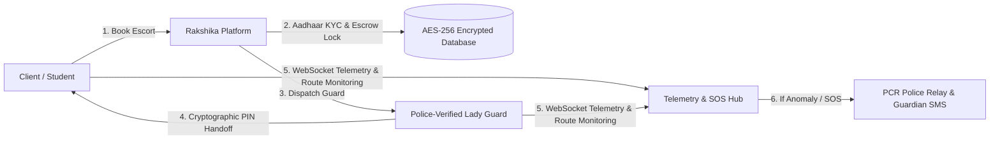

# RAKSHIKA (रक्षिका): END-TO-END PRODUCT SPECIFICATION & VISION DOSSIER
**Empowering Women’s Freedom of Mobility Across India Through Real-Time Telemetry & Police-Verified Female Security Escorts**

---

## 1. EXECUTIVE SUMMARY & MISSION STATEMENT

### 1.1 The Crisis
In India, gender-based violence and crimes against women—ranging from street harassment and stalking to physical and sexual assault—remain severe barriers to women's independence, education, and economic participation. Traditional security measures rely heavily on passive "SOS button" applications, which merely send an SMS notification after a crime has already commenced, leaving victims without immediate physical defense or verified protection.

### 1.2 The Solution: RAKSHIKA
**Rakshika** (meaning *The Shield*) is India’s first integrated, on-demand physical protection and real-time telemetry network. Rakshika connects women, female students, and guardians with **Police-Verified, Background-Vetted Female Security Personnel ("Lady Bouncers / Protection Officers")** for physical escort during late-night transits, inter-city exam travel, solos commutes, and high-risk environments.

Supported by cryptographic handoff locks, real-time WebSocket telemetry, Aadhaar KYC verification, and direct police control room (PCR) integration, Rakshika transforms personal safety from passive panic alerts into **active physical deterrence and instant emergency response**.

---

## 2. THE PROBLEM VS. THE RAKSHIKA SOLUTION

| Problem Metric in India | Conventional Safety Apps / Cabs | Rakshika Telemetry & Escort Network |
| :--- | :--- | :--- |
| **Physical Intervention** | None. Driver is un-vetted for tactical protection. | **Immediate.** Dedicated, trained female security escorts physically accompany the client. |
| **Identity Verification** | Standard phone number / driver registration (vulnerable to spoofing). | **Aadhaar-linked KYC** with AES-256-CBC field encryption for both client & escort. |
| **Pick-up Handoff Security** | Name verification orally (high impersonation risk). | **Cryptographic 4-digit PIN lock** (2FA matching client app & guard terminal). |
| **Low-Connectivity / Underground Coverage** | Fails when cellular data drops (metro basements/subterranean transit). | **Offline BLE Mesh Fallback** using RSSI proximity tracking. |
| **Emergency Response** | Generic SMS to family members with delay. | **Multi-Tier Dispatch:** Ambient audio stream + Guardian SMS + PCR Police Relay + Geofenced Guard Alert. |
| **Financial Transparency** | Pre-charged standard fare without safety guarantee. | **Escrow Deposit Lock:** Funds held securely until journey completion is verified via geofence. |

---

## 3. CORE PRODUCT USE CASES & TARGET PERSONAS

### 3.1 Inter-City Examination & College Entrance Commutes
- **Target Persona:** Female students (ages 16–25) traveling across states or cities (e.g., Delhi, Kota, Patna, Bengaluru) for competitive exams (NEET, JEE, UPSC).
- **Product Feature:** *Inter-City Exam Mode*. Allows parents/guardians to book a verified lady guard at train station platforms or bus terminals, ensuring safe transit directly to the exam center and back.

### 3.2 Late-Night Corporate & BPO Transit
- **Target Persona:** Women working night shifts in IT, healthcare, hospitality, or corporate sectors.
- **Product Feature:** *Hourly Transit Escort*. On-demand dispatch of female protection officers for last-mile commute from metro stations, office hubs, or ride-share drop-offs to home doorsteps.

### 3.3 Public Events & Crowd Protection
- **Target Persona:** Women attending concerts, festivals, rallies, or crowded public gatherings.
- **Product Feature:** *VIP & Event Protection Mode*. Multi-guard tactical escort booking with body-camera telemetry for crowd control and safe egress.

### 3.4 Guardian / Parent Remote Supervision
- **Target Persona:** Parents or guardians managing their daughter's safety remotely.
- **Product Feature:** *Guardian Dashboard*. Live dual-tracking showing guard credentials, real-time route telemetry, device battery state, and instant emergency control.

---

## 4. END-TO-END PRODUCT FEATURE SPECIFICATIONS

### 4.1 Module 1: Lady Guard Discovery & Verification System
- **Police & Background Verification Badge:** Every guard profile lists active police verification numbers (e.g., `POL-DEL-8941`), background check badges, body-camera equipment status, and non-lethal weapons certification (pepper spray, tactical baton, taser).
- **Physical Metrics & Skills Transparency:** Displays experience, language proficiency (Hindi, English, Regional languages), martial arts qualifications (e.g., Blackbelt), and crowd control experience.
- **Dynamic Availability Radar:** Live map display showing nearby available verified female escorts within a dynamic radius.

### 4.2 Module 2: Cryptographic Handoff & Escrow Engine
- **Cryptographic Security PIN:** Upon booking confirmation, a 4-digit PIN is generated. The journey cannot start, nor can escrow funds be released, until the guard validates the PIN provided by the client in person.
- **Automated Escrow Lock:** Payments are held safely in a digital escrow state. If a booking is cancelled or compromised prior to verified handoff, funds remain protected.

### 4.3 Module 3: Real-Time Telemetry & Geofenced Tracking Hub
- **Sub-Second Location Streaming:** Built on WebSockets (`Socket.IO`), providing smooth vehicle/walk telemetry across interactive maps.
- **Route Anomaly Detection:** Monitors off-route deviations, unexpected extended stops, or loss of device battery.
- **Live Telemetry Metrics:** Real-time feedback showing transit progress percentage, ETA, speed, battery health, and connection status.

### 4.4 Module 4: Multi-Tier Emergency SOS Dispatch Pipeline
- **One-Swipe Panic Beacon:** Accessible from all application screens or via hardware rapid keypress simulation.
- **Silent Ambient Audio Stream:** Automatically initializes device microphone recording and streams audio packets to the security control room.
- **Multi-Channel Emergency Alert Relay:**
  1. Direct high-priority alert to **Police Control Room (PCR)** with live coordinates;
  2. Automated emergency SMS with map tracking link to registered family/guardian contacts;
  3. Immediate broadcast to nearest body-cam equipped guards in a 2 km radius.

### 4.5 Module 5: Offline BLE Mesh Fallback Network
- **Subterranean Transit Protection:** In underground metro corridors, basements, or signal dead-zones, the app activates Bluetooth Low Energy (BLE) RSSI proximity sensing.
- **Ad-Hoc Beaconing:** Relays emergency signals to nearby active Rakshika guard terminals via device-to-device mesh network without active cellular coverage.

---

## 5. TECHNICAL STACK & DATA SECURITY ARCHITECTURE

### 5.1 Technology Stack
- **Frontend App:** React 19, TypeScript, Lucide Icons, Motion (Framer Motion), Tailwind CSS, Socket.IO Client.
- **Backend API & Telemetry Server:** Node.js, Express.js, Socket.IO Server, Prisma ORM.
- **Database & Security Layer:** SQLite / PostgreSQL, AES-256-CBC field encryption, bcrypt password hashing, HTTP-only JWT sessions.

### 5.2 Data Privacy & Encryption Standard
- **Aadhaar & Government ID Security:** All 12-digit Aadhaar numbers and national ID proofs are encrypted at rest using AES-256-CBC with cryptographically random 16-byte IVs. Plaintext numbers are never stored or logged in database tables.
- **Session Authentication:** Zero-trust architecture enforcing cookie-based JWT verification on all protected endpoints (`/api/auth/me`, `/api/profile/*`, `/api/bookings/*`, `/api/sos/*`).

---

## 6. SOCIAL IMPACT & NATION-BUILDING VISION FOR INDIA

1. **Economic Empowerment for Female Security Professionals:** Creates high-paying, dignified, certified career paths for skilled women in martial arts, security, and tactical defense across urban and rural India.
2. **Restoring Women's Right to the Night (Nirbhaya Vision):** Enables female workers, students, and travelers to move freely at any time without fear, boosting female workforce participation in India.
3. **Institutional Synergy with Law Enforcement:** Acts as a force-multiplier for local police departments by providing pre-verified telemetry data, reducing response times during emergency distress calls.

---

## 7. SUMMARY TABLE OF PRODUCT CAPABILITIES

| Feature Category | Technical Implementation | Social & Functional Benefit |
| :--- | :--- | :--- |
| **KYC Identity Gate** | AES-256-CBC encrypted Aadhaar linking | Eliminates fake profiles and ensures 100% accountability |
| **Escort Verification** | Police verification ID + Background check badge | Guarantees trusted, trained physical protection |
| **Handoff Lock** | Ephemeral 4-digit PIN + Financial Escrow | Prevents impersonation and secures client funds |
| **Telemetry Network** | WebSocket `Socket.IO` coordinate streaming | Live 24/7 route tracking for guardians & control rooms |
| **Emergency SOS** | Multi-tier SMS + PCR alert + Mic streaming | Instant physical & police intervention upon distress |
| **Offline Mesh** | BLE RSSI peer-to-peer proximity sensing | Ensures safety even in underground metro stations |

---
*Document Version: 1.0.0 — Rakshika Official Product Dossier*
